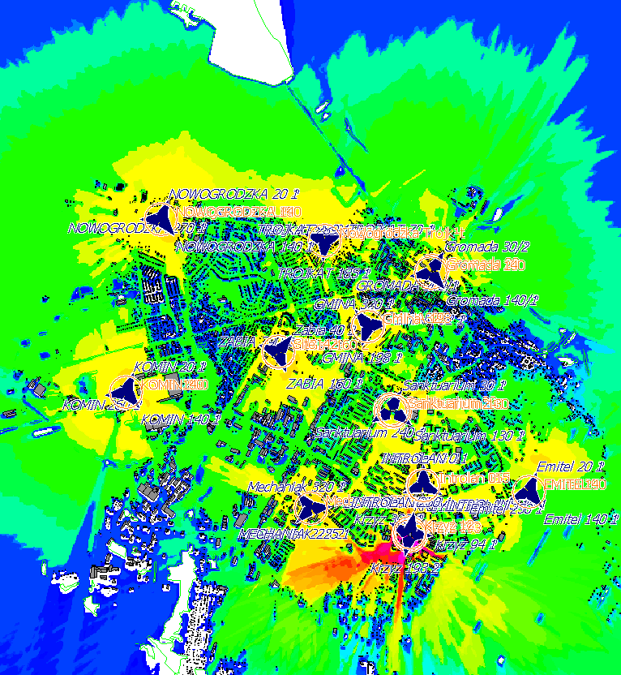
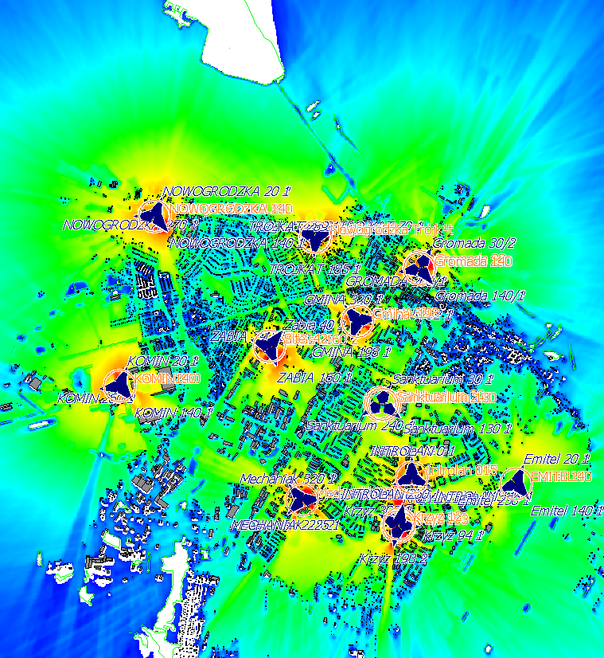
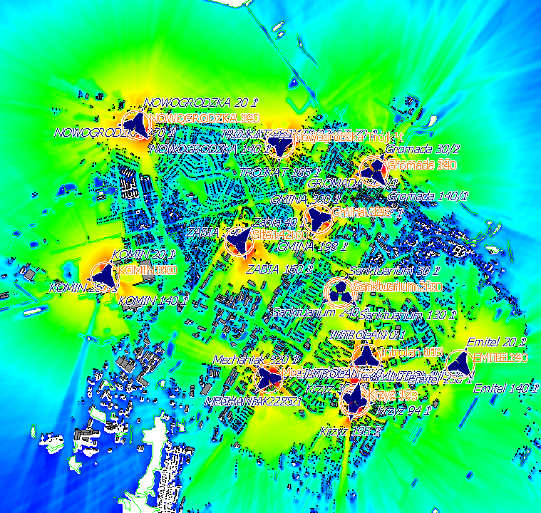

## Symulacja sieci LTE na terenie miasta Łomża na częstotliwości 2600 MHz (B7, 15MHz)
# W tym repozytorium znajduje się symulacja sieci LTE na terenie miasta Łomża.
# Throughput

# RSRP

# SINR

# Reszta dokumentacji w pliku PDF
[Link do pliku PDF](https://github.com/Merituum/FekoLomza/blob/main/Symulacja_sieci_mobilnej_LTE__2600MHz__na_terenie_miasta_%C5%81om%C5%BCa__woj__Podlaskie_.pdf)
